## 通讯录管理系统 ##

>要求：
>
>1. 向通讯录中添加联系人，限制为1000，包括姓名、性别、年龄、电话、住址
>2. 显示联系人，显示当前通讯录中的所有联系人的相关信息
>3. 删除联系人，输入要删除的联系人进行删除
>4. 查找联系人
>5. 修改联系人，指定属性修改或者是全部属性修改
>6. 清空联系人
>7. 退出通讯录系统

#### 一、通讯录菜单显示 ####

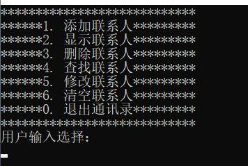

#### 二、添加联系人 ####

添加**张三**联系人：

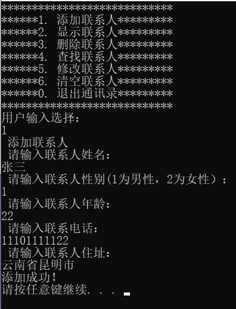

添加**李四**联系人：

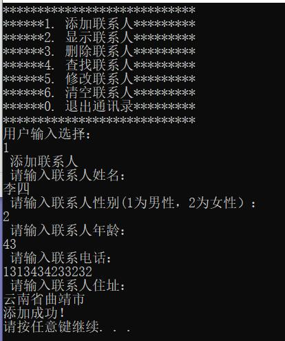

#### 三、显示联系人 ####

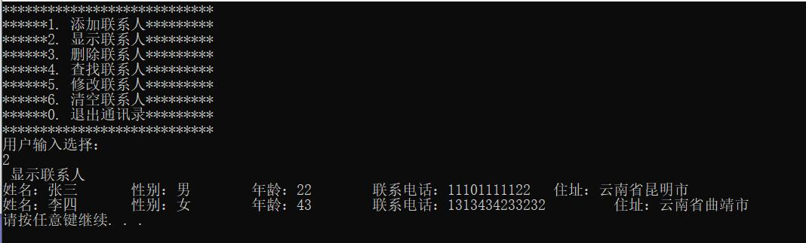

#### 四、删除联系人 ####

删除**张三**联系人

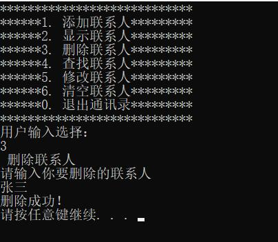

删除后查看当前所有的联系人信息：

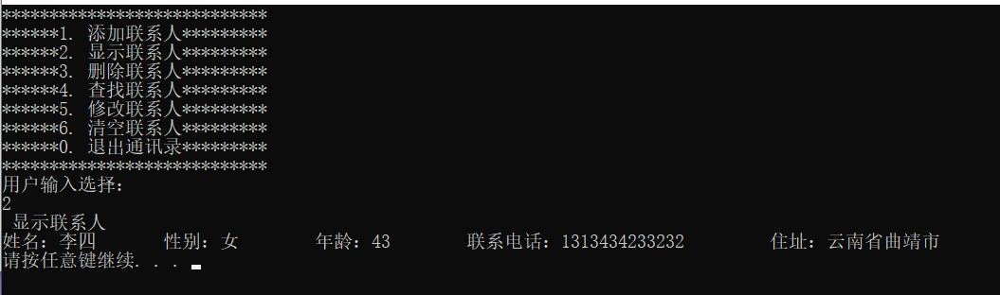

#### 五、查找联系人 ####

查找**李四**

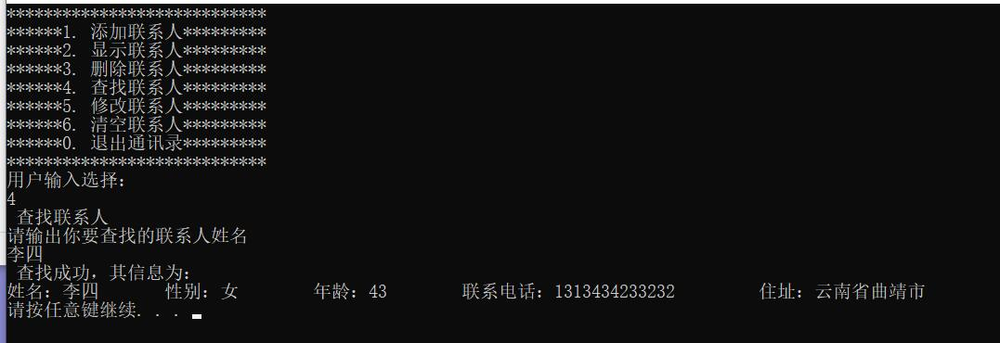

#### 六、修改联系人 ####

将**李四**修改成**王五**

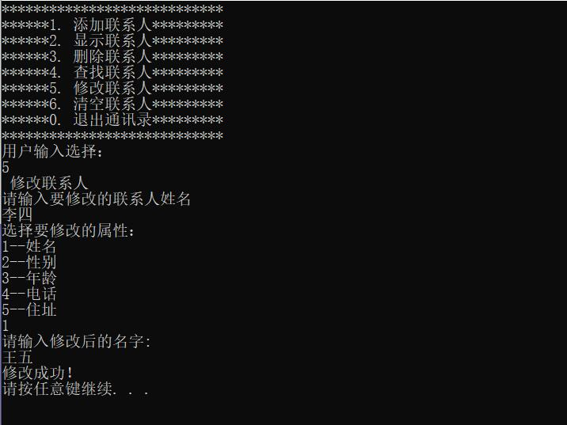

修改成功后，重新显示联系人信息：

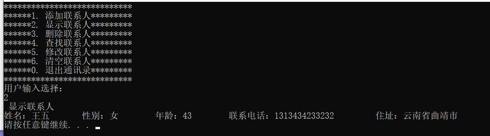

#### 七、清空联系人 ####

清空联系人并确定是否清空

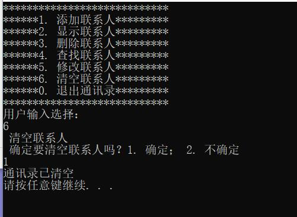

重新查看通讯录的内容：

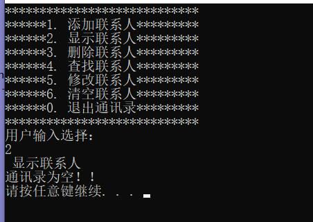

#### 八、退出通讯录 ####

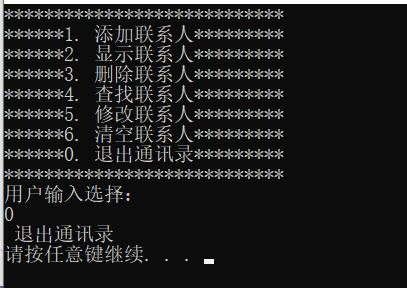

